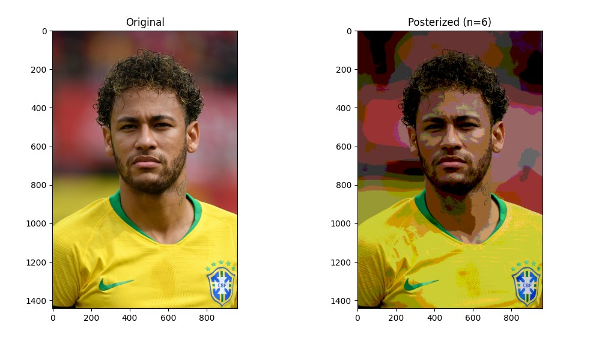

# Posterization using OpenCV

This project implements Posterization of images using OpenCV, NumPy, and Matplotlib.
Posterization is used to give a stylized, cartoon-like appearance . This technique is commonly used in apps like Photoshop Express and Snapseed.

# How the program Works:

Input Image, which is read as BGR is converted to RGB for correct plotting in Matplotlib. 
Then small Median Blur is applied to smoothen image. 
A Look-Up Table (LUT) is created to limit pixel intensity levels to n evenly-spaced values.
Applying cv2.LUT() produces the posterized effect.
The output is then displayed

# Steps to Run

   1. Install Dependencies by running this: 
    pip install -r requirements.txt
   2. Input images are placed in assets folder with name "input.jpg"
   3. Run the main script:
      python src/main.py
   4. output will be saved in results

